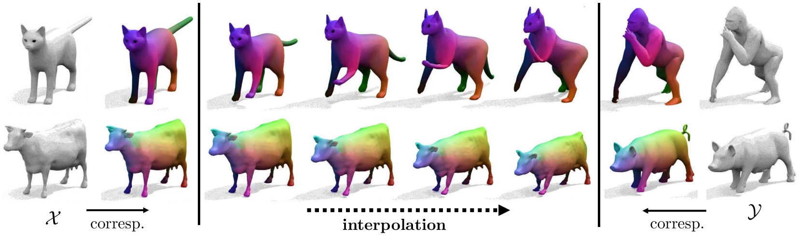

# NeuroMorph: Unsupervised Shape Interpolation and Correspondence in One Go



This repository provides our implementation of the CVPR 2021 [paper NeuroMorph](https://openaccess.thecvf.com/content/CVPR2021/html/Eisenberger_NeuroMorph_Unsupervised_Shape_Interpolation_and_Correspondence_in_One_Go_CVPR_2021_paper.html). Our algorithm produces in one go, i.e., in a single feed forward pass, a smooth interpolation and point-to-point correspondences between two input 3D shapes. It is learned in a self-supervised manner from an unlabelled collection of deformable and heterogeneous shapes.

If you use our work, please cite:

```
@inproceedings{eisenberger2021neuromorph, 
  title={NeuroMorph: Unsupervised Shape Interpolation and Correspondence in One Go}, 
  author={Eisenberger, Marvin and Novotny, David and Kerchenbaum, Gael and Labatut, Patrick and Neverova, Natalia and Cremers, Daniel and Vedaldi, Andrea}, 
  booktitle={Proceedings of the IEEE/CVF Conference on Computer Vision and Pattern Recognition}, 
  pages={7473--7483}, 
  year={2021}
}
```

## Requirements

The code was tested on Python 3.8.10 with the PyTorch version 1.9.1 and CUDA 10.2.
The code also requires the pytorch-geometric library ([installation instructions](https://pytorch-geometric.readthedocs.io/en/latest/notes/installation.html)) and [matplotlib](https://matplotlib.org).
Finally, MATLAB with the Statistics and Machine Learning Toolbox is used to pre-process ceratin datasets (we tested MATLAB versions 2019b and 2021b).
The code should run on Linux, macOS and Windows.

## Installing NeuroMorph

Using Anaconda, you can install the required dependencies as follows:

```bash
conda create -n neuromorph python=3.8
conda activate neuromorph
conda install pytorch cudatoolkit=10.2 -c pytorch
conda install matplotlib
conda install pyg -c pyg -c conda-forge
```

## Running NeuroMorph

In order to run NeuroMorph:

* Specify the location of datasets on your device under `data_folder_<dataset>` in `param.py`. 
* To use your own data, create a new dataset in `data/data.py`.
* To train FAUST remeshed, run the main script `main_train.py`. Modify the script as needed to train on different data.

For a more detailed tutorial, see the next section.

## Reproducing the experiments

We show below how to reproduce the experiments on the FAUST remeshed data.

### Data download

You can download experimental mesh data from [here](https://nuage.lix.polytechnique.fr/index.php/s/LJFXrsTG22wYCXx) from the authors of the [Deep Geometric Functional Maps](https://github.com/LIX-shape-analysis/GeomFmaps).
Download the `FAUST_r.zip` file from this site, unzip it, and move the content of the directory to `<NEUROMORPH_ROOT>/data/mesh/FAUST_r` .

### Data preprocessing

Meshes must be subsampled and remeshed (for data augmentation during training) and geodesic distance matrices must be computed before the learning code runs.
For this, we use the `data_preprocessing/preprocess_dataset.m` MATLAB scripts (we tested V2019b and V2021b).

Start MATLAB and do the following:

```matlab
cd <NEUROMORPH_ROOT>/data_preprocessing
preprocess_dataset("../data/meshes/FAUST_r/", ".off")
```

The result should be a list of MATLAB mesh files in a `mat` subfolder (e.g., `data/meshes/FAUST_r/mat` ), 
plus additional data.

### Model training

If you stored the data in the directory given above, you can train the model by running:

```bash
mkdir -p data/{checkpoint,out}
python main_train.py
```

The trained models will be saved in a series of checkpoints at `<NEUROMORPH_ROOT>/data/out/<TIME_STAMP_FAUST>` .
Otherwise, edit `param.py` to change the paths.

### Model testing

Upon completion, evaluate the trained model with `main_test.py` . Specify the checkpoint folder name `<TIME_STAMP_FAUST>` by running:

```bash
python main_test.py <TIME_STAMP_FAUST>
```

Here `<TIME_STAMP_FAUST>` is any of the directories saved in `<NEUROMORPH_ROOT>/data/out/` .
This automatically saves correspondences and interpolations on the FAUST remeshed test set to `<NEUROMORPH_ROOT>/data/out/<TIME_STAMP_FAUST>` .
For reference, on FAUST you should expect a validation error around 0.25 after 400 epochs.

## Contributing

See the [CONTRIBUTING](CONTRIBUTING.md) file for how to help out.

## License

NeuroMorph is MIT licensed, as described in the [LICENSE](LICENSE) file.
NeuroMorph includes a few files from other open source projects, as further detailed in the same [LICENSE](LICENSE) file.
